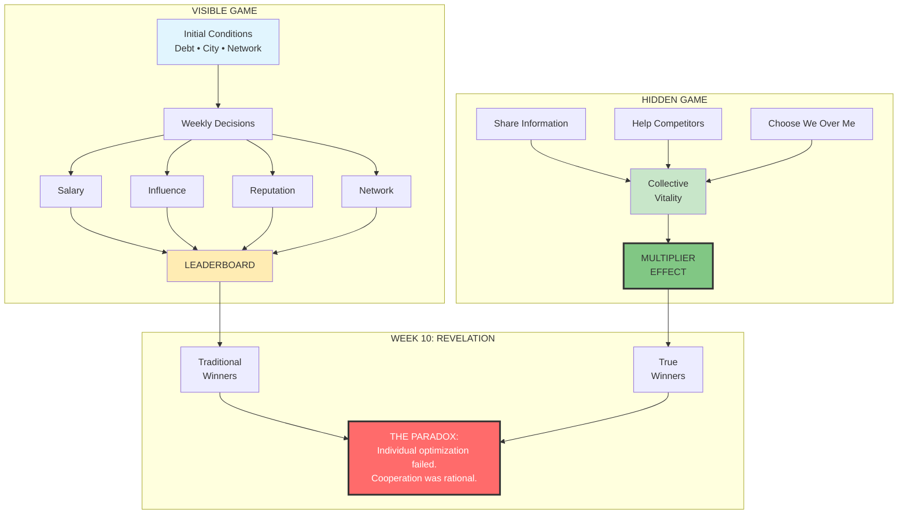

# MERIT GAMES - SIMULATION OVERVIEW

## CORE ARCHITECTURE

### The Game Engine
A 10-week life simulation where students navigate career decisions while competing on visible metrics and unknowingly being scored on cooperation.

### Three Layers of Play
1. **Surface Layer**: Traditional success metrics competition
2. **Hidden Layer**: Cooperation tracking and collective benefit scoring  
3. **Meta Layer**: Recognition that the game itself is the problem

## KEY COMPONENTS

### Time Structure
- **10 weeks** = 10 simulated years
- **Weekly cycle**: Market Update → Decisions → Consequences → Social Phase
- **Real-time pressure**: 24-48 hour decision windows
- **Accelerating complexity**: Crisis frequency increases each week

### Scoring System
**Visible Metrics (60%)**
- Salary: Career earnings trajectory
- Influence: Impact and reach
- Reputation: Trust and consistency  
- Network: Connection quality/quantity

**Hidden Metric (40%)**
- Collective Vitality: Cooperation, knowledge-sharing, positive-sum choices
- Multiplies over time, compounds in final weeks
- Only revealed at game's end

### Decision Types
- **Career**: Job moves, industry pivots, education
- **Resources**: Time, money, political capital allocation
- **Crisis**: Scandals, health, family, economic shocks
- **Ethics**: Whistleblowing, loyalty, information sharing
- **Social**: Relationships, alliances, betrayals

## GAME FLOW

### The Architecture of Deception

## ALGORITHMIC BEHAVIOR

### Adaptive Elements
- **Rule Changes**: Unannounced shifts in what behaviors reward
- **Counter-Strategies**: Algorithm learns and blocks dominant patterns
- **Information Asymmetry**: Different players see different opportunities
- **Noise Injection**: False signals mixed with real data

### Real-World Integration
- Stock market movements affect game economy
- News events trigger crisis scenarios
- Class dynamics influence game state
- Professor can inject wild cards

## INTERACTION DYNAMICS

### Competition Mechanics
- Zero-sum: Jobs, network connections are finite
- Relative scoring: Influence measured against peers
- Reputation attacks: Can damage others
- Information hoarding: Knowledge as currency

### Cooperation Mechanics  
- Information sharing: Helps all, costs individual advantage
- Mutual support: Crisis assistance
- Joint ventures: Shared risk/reward
- Collective action: Some problems only solvable together

## THE REVELATION

### Week 10 Transformation
1. Individual optimization strategies begin failing
2. Collective action problems emerge requiring cooperation
3. Hidden metric multipliers activate
4. True algorithm revealed: rewards collaboration exponentially
5. "Winners" realize the game's real lesson

### Three Possible Outcomes
- **Win the Wrong Game**: Top visible metrics, low cooperation
- **Discover the Hidden Game**: Balance visible and hidden success
- **Reject the Game**: Recognize system's fundamental flaws

## DESIGN PHILOSOPHY

The simulation is a **trap that teaches**:
- Mirrors real-world incentive structures
- Rewards individual optimization initially
- Punishes pure self-interest eventually  
- Reveals cooperation as rational strategy
- Questions what "winning" means

The cruelest truth: Even understanding the game completely doesn't free you from playing it.

## CINEMATIC TRANSLATION

### Visual Representation
- **Dashboard Aesthetic**: Clean, corporate, seductive
- **Leaderboard Drama**: Public rankings drive tension
- **Decision Moments**: Time pressure visualization
- **Crisis Alerts**: Breaking news style interruptions
- **Revelation Sequence**: Hidden metrics emerge like virus spreading

### Narrative Function
- Externalizes internal character conflicts
- Makes abstract themes concrete
- Provides clear stakes/consequences
- Enables betrayal mechanics
- Forces moral choices under pressure

The game isn't just plot device—it's the film's central metaphor for how algorithms shape human behavior by defining what we optimize for, while hiding what actually matters.