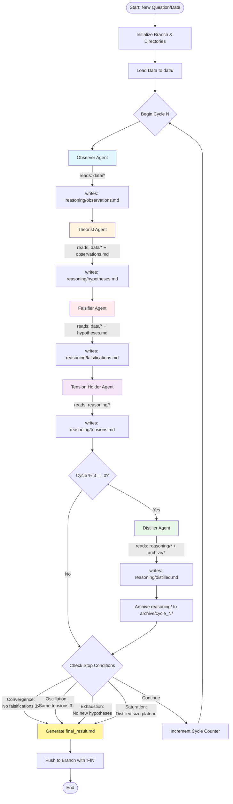
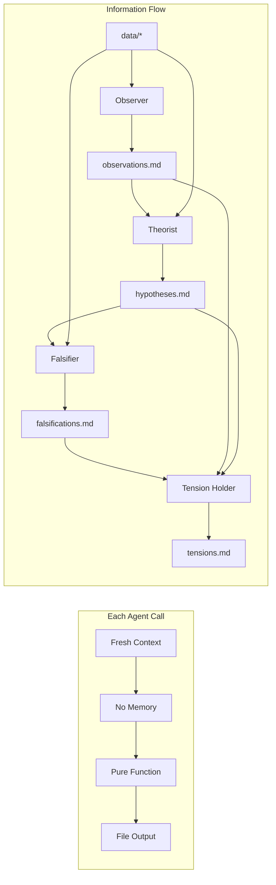
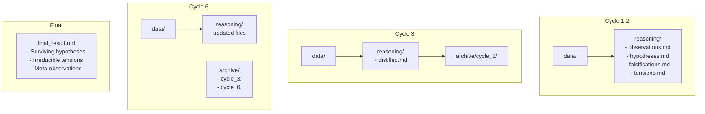

# Dialectic Engine Architecture

## System Flow Visualization

## Agent Isolation Principle

## Directory Structure Evolution

## Key Principles

- **No Memory Between Calls**: Each agent invocation is stateless
- **File-Based Communication**: All outputs written to files for persistence
- **Sequential Processing**: Strict order ensures dialectical reasoning
- **Periodic Compression**: Distiller reduces complexity every 3 cycles
- **Automatic Termination**: Multiple stop conditions prevent infinite loops